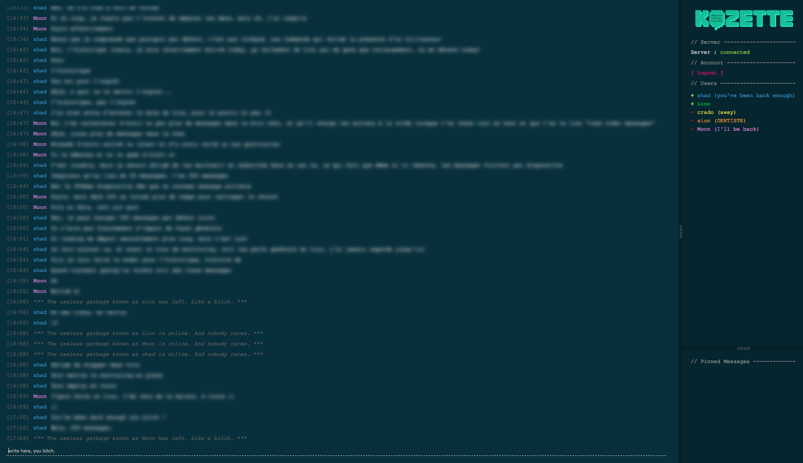

Kozette is a simple T'Chat built with Meteor. Tends to go for an old school style, kinda web app terminal like.

---

List of available commands :

- `/nick [*nickname*]` : change user nickname (and is username for login)
- `/color [*color*]` : change user color
- `/me [*message*]` : add a direct message linked to the user and his color
- `/status [*status(empty to remove)*]` : add a status on the users list
- `/pin [*message*]` : in addition to adding a classic message, pin the message to stay always visible on the pinned messages panel
- `/mute` `/unmute` : to mute sounds of the web app (show a special red logo has a feedback and also a line-through the username for other users to see)
- `/kick-user [*username*]` : (admin/moderator only) kick a user off the chat
- `/delete-user [*username*]` : (admin only) delete a user account
- `/set-moderator [*username*]` : (admin only) add a user to the moderator role
- `/remove-moderator [*username*]` : (admin only) remove a user from the moderator role

User visual roles :

- `@` : administrator
- `&` : moderator
- `+` : online basic user
- `-` : offline basic user

---
Special thanks to [Sion](https://github.com/fueledbycoffee), from fueledbc.com for his help with the code, the logo and the sounds !

Kozette is distributed under the [MIT License](http://opensource.org/licenses/MIT)

